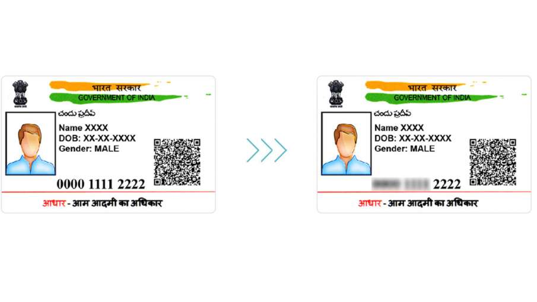
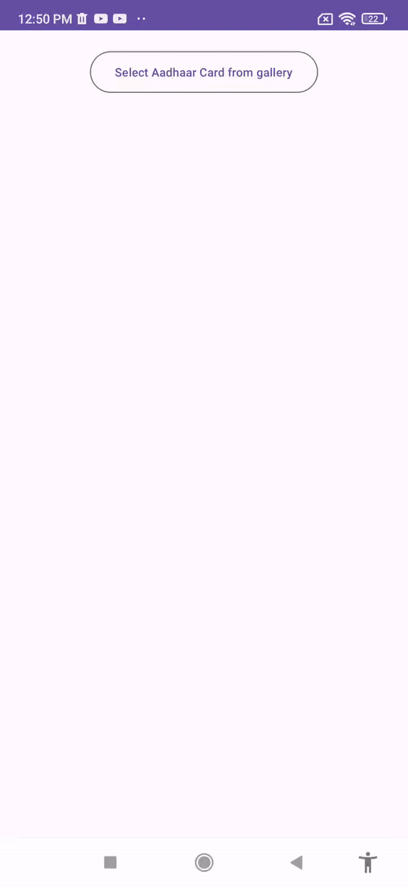
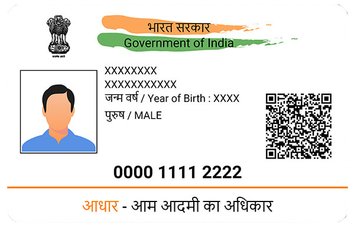

# Aadhaar Masking Android

Aadhaar Masking Library lets you mask the first 8-digits of your Aadhaar number, while the other 4 digits will be visible.

[](https://jitpack.io/#rinkeshjain/aadhaar-masking-android)


## Demo









## Installation
#### Add the gradle dependency

Add JitPack repository to your root build.gradle at the end of repositories:
```
allprojects {
		repositories {
			...
			maven { url 'https://jitpack.io' }
		}
	}
```

Add the Library dependency in app gradle file:
```bash
  dependencies {
	        implementation 'com.github.rinkeshjain:aadhaar-masking-android:0.0.4'
	}
```


## Usage/Examples

```kotlin

        val pickMedia =
            rememberLauncherForActivityResult(ActivityResultContracts.PickVisualMedia()) { uri ->
                if (uri != null) {
                    Log.d("PhotoPicker", "Selected URI: $uri")
                    isLoading = true
                    lifecycleScope.launch(Dispatchers.Default) {
                        //you need to pass file uri in processImageForMasking method respone is File
                        fileName = MaskingManager.processImageForMasking(this@MainActivity, uri)
                        isLoading = false
                    }

                } else {
                    Log.d("PhotoPicker", "No media selected")
                }

            }


```
Call Method for Image Picker
```kotlin
   pickMedia.launch(PickVisualMediaRequest(ActivityResultContracts.PickVisualMedia.ImageOnly))

```


## Roadmap

- Support Image Capture from Camera

- Read PDF from File Picker

- Support Image Optimisation


## Authors

- [Rinkesh Jain](https://www.github.com/rinkeshjain)


## License

[MIT](https://choosealicense.com/licenses/mit/)


Copyright (c) 2023 Rinkesh Jain

Permission is hereby granted, free of charge, to any person obtaining a copy
of this software and associated documentation files (the "Software"), to deal
in the Software without restriction, including without limitation the rights
to use, copy, modify, merge, publish, distribute, sublicense, and/or sell
copies of the Software, and to permit persons to whom the Software is
furnished to do so, subject to the following conditions:

The above copyright notice and this permission notice shall be included in all
copies or substantial portions of the Software.
